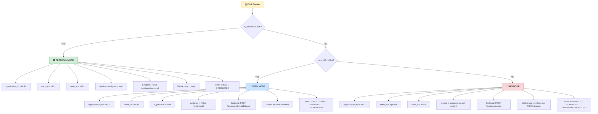
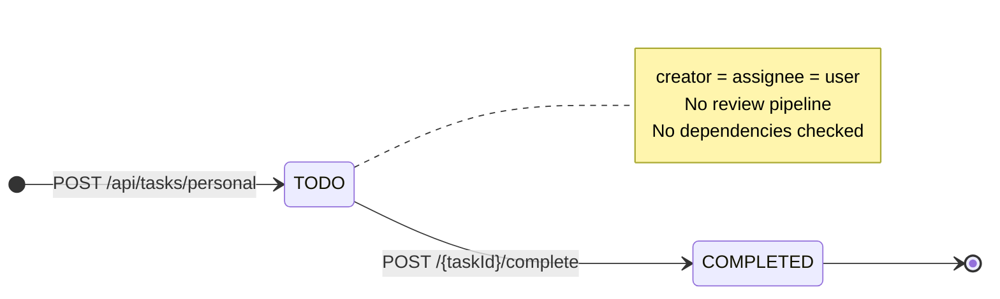
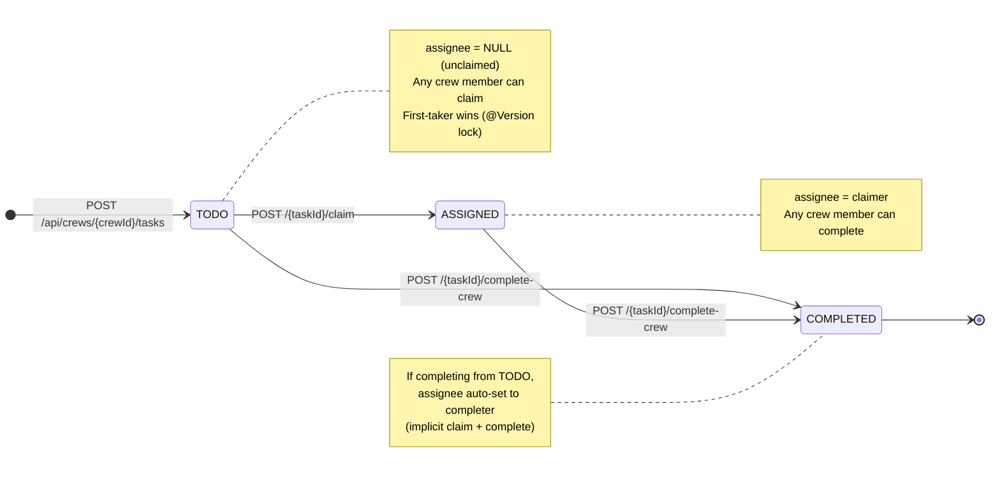
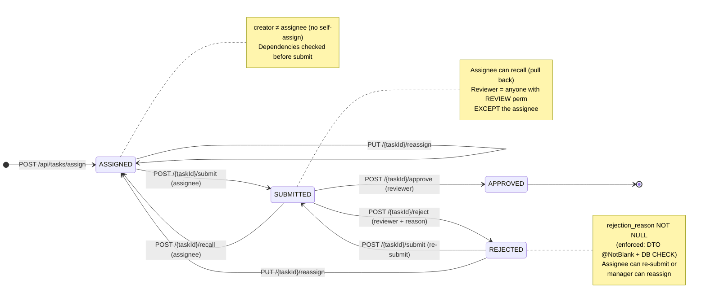
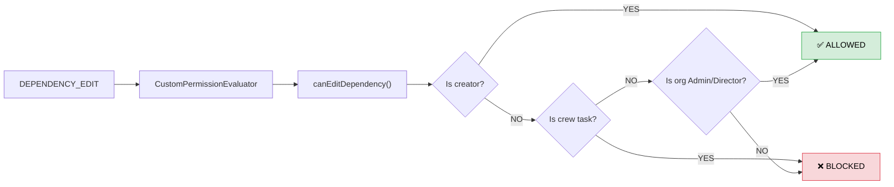

# Mode Boundary & Task State Machine Diagrams

> Derived from live backend source code. All corrections applied (crew claiming flow, reviewer rules, dependency locking).

---

## 1. Mode Boundary Diagram — Task Routing

### Mutual Exclusivity Rules (enforced in `TaskAssignmentService`)

| Field | Personal | Crew | Org |
|---|:---:|:---:|:---:|
| `organization_id` | `NULL` | `NULL` | `NOT NULL` |
| `team_id` | `NULL` | `NULL` | optional |
| `crew_id` | `NULL` | `NOT NULL` | `NULL` |
| `is_personal` | `true` | `false` | `false` |
| `assignee` | `= creator` | `NULL` (unclaimed) | `≠ creator` |
| `initial_status` | `TODO` | `TODO` | `ASSIGNED` |

> [!IMPORTANT]
> These three modes are **mutually exclusive at the entity level**. A task belongs to exactly one mode. The `TaskAssignmentService` enforces this by nullifying cross-mode fields (e.g., crew task always sets `org=NULL`, `team=NULL`).

---

## 2. Task State Machine — Personal Mode

**Rules**:
- Only the creator can complete
- No submit/approve/reject flow
- `COMPLETED` is terminal

---

## 3. Task State Machine — Crew Mode

**Rules**:
- **No review pipeline** — `submitTask()`, `approveTask()`, `rejectTask()` all block crew tasks
- Any crew member can claim or complete (flat structure, no hierarchy)
- Self-assign is allowed (unlike org mode)
- Creator CAN also complete their own task
- Dependencies are **creator-locked** (`canEditDependency` → creator + org admin/director only)

---

## 4. Task State Machine — Org Mode (Review Pipeline)

**Review Permission Rules**:

| Actor | Can Review? | Enforced By |
|---|:---:|---|
| **Assignor (creator)** | ✅ Yes | `EmployeeStrategy.canReview()` — no creator block |
| **Assignee** | ❌ No | `EmployeeStrategy.canReview()` — assignee blocked |
| **Org Manager+** | ✅ Yes | Must be same org as task |
| **Super Admin** | ❌ No | Privacy boundary — can't review org tasks |

---

## 5. Dependency Edit Permissions

> [!CAUTION]
> The **assignee** cannot edit dependencies. This is intentional — dependencies are "assignor-locked" per spec.

---

## 6. API Endpoint → State Transition Map

| Endpoint | Modes | From Status | To Status |
|---|---|---|---|
| `POST /api/tasks/personal` | Personal | — | `TODO` |
| `POST /api/crews/{crewId}/tasks` | Crew | — | `TODO` |
| `POST /api/tasks/assign` | Org | — | `ASSIGNED` |
| `POST /{id}/complete` | Personal | `TODO` | `COMPLETED` |
| `POST /{id}/claim` | Crew | `TODO` | `ASSIGNED` |
| `POST /{id}/complete-crew` | Crew | `TODO` or `ASSIGNED` | `COMPLETED` |
| `POST /{id}/submit` | Org | `ASSIGNED` or `REJECTED` | `SUBMITTED` |
| `POST /{id}/approve` | Org | `SUBMITTED` | `APPROVED` |
| `POST /{id}/reject` | Org | `SUBMITTED` | `REJECTED` |
| `POST /{id}/recall` | Org | `SUBMITTED` | `ASSIGNED` |
| `PUT /{id}/reassign` | Org | `ASSIGNED` or `REJECTED` | `ASSIGNED` |
